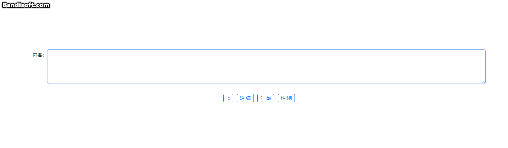

# ClickableFilledTextarea

这是一个基于 `antd` 的 `<Input.Textarea />` 封装的支持点击填入到文本区域的组件。

下图为该组件的展示效果。



## 属性介绍

| 属性名 | 说明 | 类型 | 默认值 |
| --- | --- | --- | --- |
| form | 经 Form.useForm() 创建的 form 控制实例 | [FormInstance](https://ant-design.antgroup.com/components/form-cn#forminstance) | - |
| textareaName | 文本域的 name 属性 | string | - |
| options | 点击可填入的选项，label 为显示的文本，value 为填入的值 | { label: string, value: string }[] | - |
| buttonGutter | 按钮之间的间距 | number | 10 |
| FormItemProps | 传递给文本域的 Form.Item 的属性 | [FormItemProps](https://ant-design.antgroup.com/components/form-cn#formitemprops) | - |
| InputTextareaProps | 传递给 Textarea 的属性 | [InputTextareaProps](https://ant-design.antgroup.com/components/input-cn#inputtextarea) | - |
| ButtonProps | 传递给按钮的属性 | [ButtonProps](https://ant-design.antgroup.com/components/button-cn#buttonprops) | - |

## 安装和启动此项目
```bash
# 进入项目后安装依赖
npm install
# 启动项目
npm run dev
```

## 使用示例

可见 [APP.tsx](./src/App.tsx)

```tsx
import { Form } from 'antd'
import ClickableFilledTextarea from './components/ClickableFilledTextarea'
import './App.css'

function App() {
  const [form] = Form.useForm()

  return (
    <div className="App">
      <Form form={form} style={{ width: '1280px' }}>
        <ClickableFilledTextarea
          form={form}
          textareaName="content"
          options={[
            {
              label: 'id',
              value: '{id}',
            },
            {
              label: '姓名',
              value: '{name}',
            },
            {
              label: '年龄',
              value: '{age}',
            },
            {
              label: '性别',
              value: '{gender}',
            }
          ]}
          FormItemProps={{ label: '内容' }}
        />
      </Form>
    </div>
  )
}

export default App
```